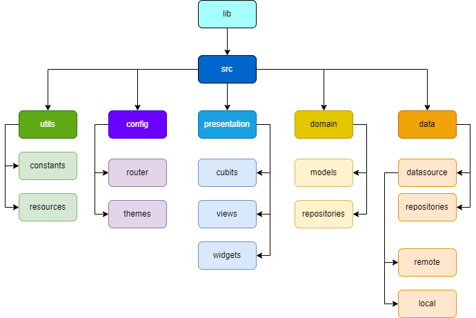

# OnFly - Case Técnico
Este repositório tem como objetivo desenvolver o case técnico da empresa OnFly traduzido para uma aplicação mobile desenvolvida em Flutter.

## Arquitetura do projeto

O projeto foi desenvolvido utilizando a arquitetura Clean Architecture, visando uma melhor testabilidade, escalabilidade e facilidade de manutenção. Inicialmente, foram utilizadas chamadas de dados mockadas para o desenvolvimento, mas a arquitetura adotada permite a troca transparente entre diferentes fontes de dados, como APIs e bancos de dados locais, sem impactar a lógica da aplicação.

A arquitetura é organizada em cinco camadas principais:

#### Presentation
Na camada de apresentação, são gerenciados todos os componentes de interface do usuário (UI) do projeto. Isso inclui widgets, telas (views) e os cubits responsáveis pela gestão e emissão de estados para as views.

#### Domain
A camada de domínio abriga os modelos de dados e as regras de negócio da aplicação. Aqui, os dados são encapsulados e definidos os contratos que as camadas superiores devem seguir para acessá-los. Isso garante que a camada de domínio permaneça independente das fontes de dados específicas.

#### Data
Responsável por lidar com o acesso aos dados, sejam eles provenientes de fontes internas ou externas, como APIs. A camada de dados é projetada para permitir a substituição transparente de fontes de dados, garantindo que essa mudança não afete outras partes da aplicação.

#### Config
Nesta camada, são armazenados arquivos de configuração, como as definições de rotas utilizadas pela biblioteca Go_Route e as configurações de tema do aplicativo. Isso facilita a organização e manutenção das configurações do projeto.

#### Utils
A camada de utilitários contém arquivos com funcionalidades gerais e constantes que são amplamente utilizadas em todo o projeto, promovendo a reutilização de código e uma melhor organização do projeto.

---

## Funcionalidades

#### Lista de despesas
Esta tela do aplicativo exibe uma listagem de despesas, mostrando informações detalhadas sobre cada despesa. Os usuários têm a capacidade de adicionar, editar ou excluir despesas. A funcionalidade é baseada no princípio "offline first", onde as despesas são sempre adicionadas ao banco de dados local do dispositivo. Quando o usuário estiver online, essa lista é sincronizada com o servidor para armazenamento.

#### Relatorio de despesas
Nesta tela, os usuários podem visualizar um gráfico que agrupa as despesas por categoria, além de uma lista com descrições, datas e valores das despesas, agrupadas por categoria. O gráfico é gerado com base na lista local do usuário.

#### Extrato do cartão corporativo
Aqui, os usuários podem acessar informações sobre o cartão corporativo, incluindo o extrato de compras. As informações são agrupadas por mês/ano e exibem a descrição completa, juntamente com a data e o valor de cada transação.

#### Lista de voos
Nesta tela, os usuários têm acesso às informações de todos os cartões de embarque emitidos em seu nome. A lista fornece informações essenciais para o dia do voo, permitindo que os usuários se preparem adequadamente.

---

## Decisões técnicas e melhorias futuras

1. ***Consumo APIs***
Optei por mockar todos os repositórios utilizados no projeto para agilizar o desenvolvimento, uma vez que o foco principal não era o consumo de dados de APIs. No entanto, com a arquitetura criada, a adição de chamadas reais de APIs e outros serviços impactaria apenas na camada de dados, desde que siga o contrato estabelecido pela camada de domínio.

2. ***Uso de cubits***
Utilizamos cubits para facilitar o gerenciamento de eventos, permitindo que as interfaces do usuário fossem atualizadas sem criar uma dependência entre elas com vários setStates. Encontrei algumas dificuldades ao compartilhar cubits entre widgets, o que me levou a implementar soluções alternativas para lidar com o tratamento de eventos de atualização.

3. ***Offline First***
Para aumentar a agilidade no desenvolvimento e simplificar a implementação incial, a premissa de "offline first" foi feita atualizando os dados salvos no dispositivo do usuário sempre que uma mudança de conexão para Wi-Fi é detectada. No entanto, uma melhorias futuras seria a implementação de um timer para sincronização automática em intervalos regulares (por exemplo, a cada X minutos) e a adição de uma opção de sincronização manual para oferecer mais controle ao usuário. Por enquanto, a versão inicial conta apenas com a sincronização automática. Vale ressaltar que a sincronização com o backend também foi mockada, servindo apenas para demonstrar quando a sincronização ocorre, sem envolver o consumo real de uma API.

4. ***Login visual***
O login foi implementado apenas visualmente para atender às necessidades de agilidade no desenvolvimento. Foi criada uma tela de login completa visualmente, proporcionando uma experiência de usuário consistente, mesmo sem a validação de backend. Isso permitiu que o aplicativo fosse desenvolvido como um todo, mesmo que a autenticação real ainda não tenha sido implementada.

4. ***Melhorias visuais***
Embora não tenham sido priorizadas neste caso de uso devido ao foco nas funcionalidades e na arquitetura, algumas melhorias visuais podem ser implementadas para enriquecer a experiência do usuário. Isso inclui a adição de mensagens de confirmação em operações importantes, bem como a inclusão de estados de lista vazia para fornecer uma experiência mais completa.

---

## Como testar

Para testar a aplicação, siga os passos abaixo:

1. Clone o repositório para sua máquina local.
2. Abra o arquivo main.dart no seu ambiente de desenvolvimento Flutter.
3. As informações da aba de cartões e voos serão carregadas automaticamente.
4. Para validar a funcionalidade "offline first", coloque o emulador no modo avião.
5. Adicione uma nova despesa. Uma mensagem indicando uma pendência de sincronização será exibida.
6. Desative o modo avião. A internet será reconectada e a mensagem de pendência de sincronização será removida, indicando que a pendência foi sincronizada.
7. Adicione mais despesas para visualizar o relatório com o gráfico.

